**Лабораторная работа №1**

**Анализ информационной системы**

**1. Описание системы**

Название: Notion.

Ссылка: https://www.notion.so/

Notion — цифровой SaaS-сервис для создания и редактирования страниц, заметок и управления информацией. Пользователь может создавать страницы, добавлять текстовые блоки и другие элементы, а также организовывать информацию в рабочем пространстве.

Целевая аудитория: сервис предназначен для пользователей, которым необходимо создавать, редактировать и структурировать информацию в цифровом виде. Notion может использоваться для ведения заметок, учебных материалов, рабочих документов и организации личной информации.

Основные возможности сервиса: создание страниц, редактирование содержимого страниц, добавление текстовых и других блоков, структурирование информации, работа с рабочими пространствами и хранение изменений на сервере.

Выбранный сценарий: создание страницы и добавление блока.

В рамках лабораторной работы рассматривается взаимодействие пользователя с сервисом при создании страницы и добавлении в неё содержимого, а также работа клиентской части, сетевых запросов и основных компонентов информационной системы.

**2. Анализ пользовательского интерфейса**

В выбранном сценарии основными компонентами интерфейса являются рабочее пространство Notion, страница, поле заголовка, текстовые блоки, редактор страницы и боковая панель.

Для исследования были выполнены следующие действия: открыта страница Notion, исследованы основные элементы интерфейса, создана новая страница, введено название страницы, добавлен новый блок и проанализировано взаимодействие интерфейса с клиентской и серверной частями.

**2.1. Рабочая страница**

На первом этапе была открыта рабочая страница Notion. На ней представлены основные элементы интерфейса, с которыми взаимодействует пользователь при выполнении выбранного сценария.

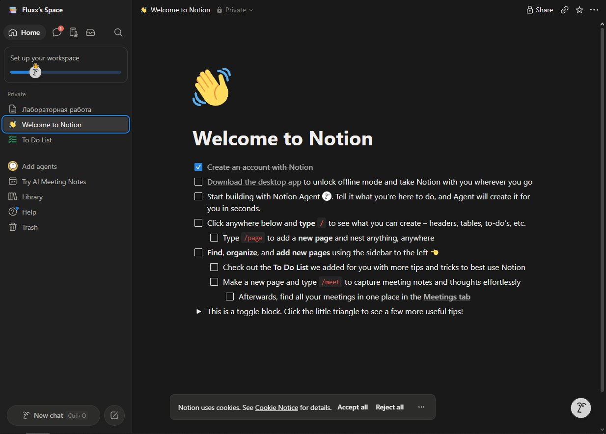

Скриншот 1 — рабочая страница Notion. На изображении представлен основной интерфейс страницы и элементы, используемые для создания страницы и добавления содержимого.

**2.2. Исследование элементов интерфейса**

Для исследования структуры интерфейса были использованы встроенные инструменты разработчика браузера DevTools.

В разделе Elements был исследован HTML-элемент заголовка страницы.

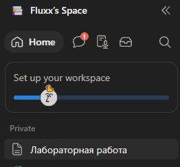

Скриншот 2 — HTML-структура заголовка страницы в DevTools. На скриншоте показан HTML-элемент заголовка страницы и его основные атрибуты.

Также был исследован HTML-элемент добавленного блока.

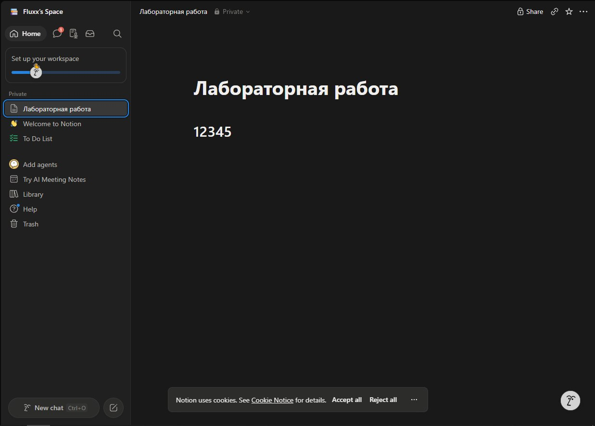

Скриншот 3 — HTML-структура добавленного блока в DevTools.

В исследованном элементе присутствуют атрибуты, связанные с редактированием содержимого:

`contenteditable="true"`

`data-content-editable-leaf="true"`

`aria-multiline="true"`

Атрибут `contenteditable="true"` позволяет пользователю изменять содержимое элемента непосредственно через интерфейс браузера.

В интерфейсе можно выделить следующие основные компоненты:

| Компонент | Назначение |
|---|---|
| Рабочее пространство | Область, в которой находятся страницы и данные пользователя |
| Страница | Основной документ для хранения информации |
| Поле заголовка | Создание и редактирование названия страницы |
| Текстовый блок | Добавление и редактирование содержимого |
| Редактор страницы | Обработка действий пользователя и изменение содержимого |
| Боковая панель | Навигация между разделами рабочего пространства |

**3. Анализ клиентской части системы**

Клиентская часть Notion работает в браузере и отвечает за отображение интерфейса, обработку действий пользователя и взаимодействие с серверной частью через сетевые запросы.

Для исследования клиентской части были использованы встроенные инструменты разработчика браузера DevTools. В ходе исследования были рассмотрены HTML-структура элементов интерфейса, их атрибуты, а также сетевые запросы, выполняемые при изменении содержимого страницы.

**3.1. Анализ HTML-структуры**

В DevTools был исследован HTML-элемент заголовка страницы Notion. Для заголовка используется HTML-элемент `<h1>`.

Элемент имеет класс:

`content-editable-leaf-rtl notion-page-block`

Также были обнаружены следующие атрибуты:

`contenteditable="true"`

`placeholder="New page"`

`data-content-editable-leaf="true"`

`aria-multiline="true"`

`aria-label="page title"`

`spellcheck="true"`

Атрибут `contenteditable="true"` указывает на возможность редактирования содержимого элемента непосредственно пользователем в браузере. Атрибут `aria-label="page title"` характеризует элемент как поле для ввода названия страницы.

Таким образом, заголовок страницы реализован как редактируемый HTML-элемент клиентской части приложения.

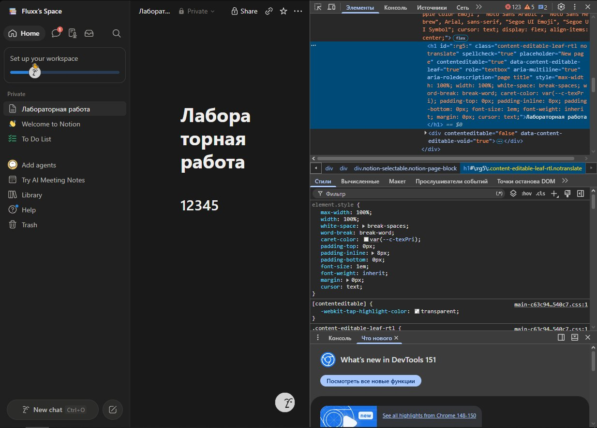

Скриншот 4 — HTML-структура заголовка страницы, его CSS-класса и основных атрибутов в разделе Elements.

Также был исследован элемент блока, созданного внутри страницы. В исследуемом случае он представлен HTML-элементом `<h2>`.

Для него используется класс:

`content-editable-leaf-rtl notion-page-block`

Были обнаружены следующие атрибуты:

`contenteditable="true"`

`placeholder="Heading 1"`

`data-content-editable-leaf="true"`

`role="textbox"`

`aria-multiline="true"`

`aria-roledescription="heading level 1"`

`spellcheck="true"`

Наличие `contenteditable="true"` показывает, что содержимое блока может изменяться пользователем непосредственно в интерфейсе. Атрибут `role="textbox"` характеризует элемент как область для ввода текста, а `aria-roledescription="heading level 1"` указывает на его заголовочное назначение.

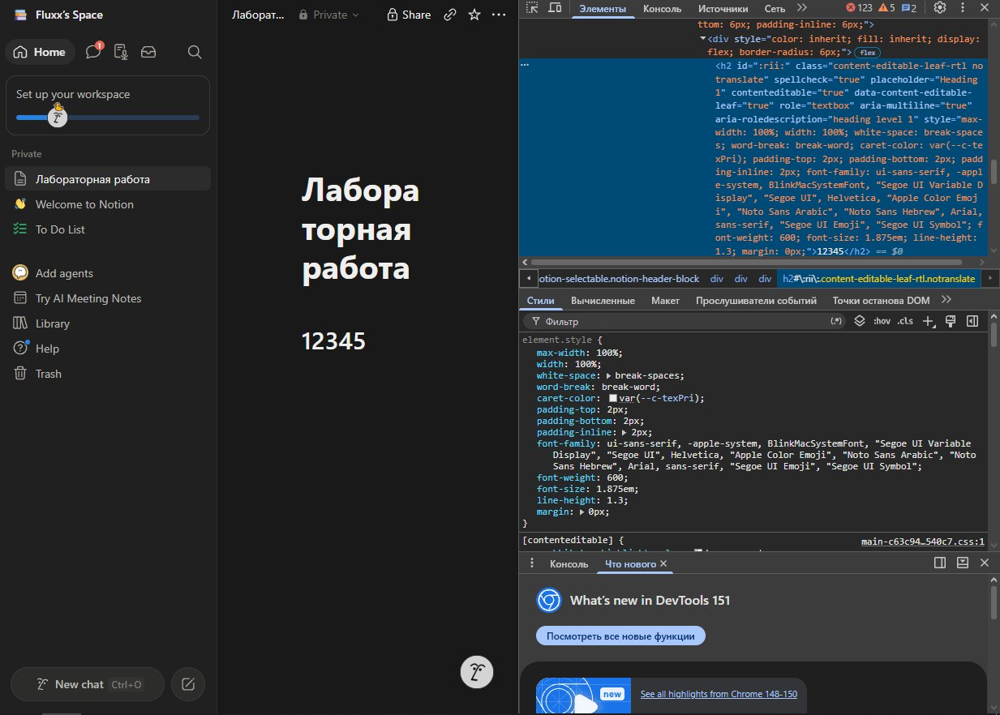

Скриншот 5 — HTML-структура созданного блока и его основных атрибутов в разделе Elements.

**3.2. Анализ сетевых запросов**

В разделе Network был исследован запрос, выполняемый при изменении содержимого страницы Notion.

Основным исследуемым запросом является `saveTransactionsFanout`. Он выполняется после изменения содержимого страницы и связан с передачей данных об изменениях серверной части приложения.

Метод запроса: POST.

Адрес: `https://app.notion.com/api/v3/saveTransactionsFanout`

Статус: 200 OK.

Протокол: HTTPS.

Скриншот 6 — сетевой запрос `saveTransactionsFanout`. На изображении видны метод POST, адрес API-запроса и успешный статус 200 OK.

В разделе Payload было установлено, что тело запроса содержит объект с параметрами `requestId` и `transactions`.

В поле `requestId` передаётся идентификатор текущего запроса.

Поле `transactions` содержит массив транзакций. В исследованном запросе были обнаружены элементы, содержащие идентификатор `id` и идентификатор рабочего пространства `spaceId`, а также другие внутренние параметры.

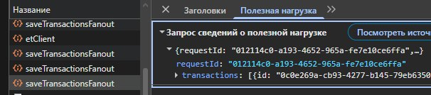

Скриншот 7 — полезная нагрузка запроса `saveTransactionsFanout`. На скриншоте показаны параметры `requestId` и `transactions`, передаваемые клиентской частью серверу.

В разделе Response сервер вернул пустой JSON-объект:

`{}`

Это означает, что в теле ответа отсутствуют дополнительные данные. При этом статус 200 OK показывает, что запрос был успешно обработан.

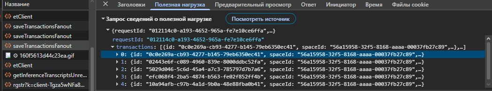

Скриншот 8 — ответ сервера на запрос `saveTransactionsFanout`.

Дополнительно в Network были обнаружены запросы:

`POST https://app.notion.com/api/v3/detectPageLanguage`

и

`POST https://app.notion.com/api/v3/getAssetsJsonV2`

Запрос `detectPageLanguage` связан с определением языка содержимого страницы.

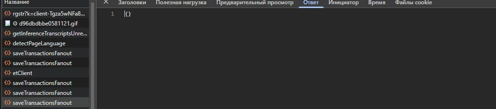

Скриншот 9 — запрос `detectPageLanguage`, обнаруженный в разделе Network.

Запрос `getAssetsJsonV2` связан с получением информации о ресурсах и данных, необходимых клиентской части приложения.

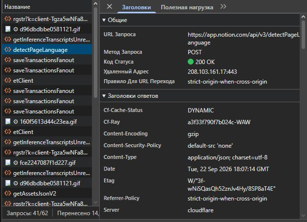

Скриншот 10 — запрос `getAssetsJsonV2`, обнаруженный в разделе Network.

**4. Анализ серверной части и API**

Серверная часть информационной системы отвечает за обработку запросов, поступающих от клиентского приложения, выполнение операций с данными и передачу результатов обратно клиенту.

Непосредственно серверная часть Notion недоступна для просмотра через браузер, поэтому её работа анализировалась по сетевым запросам, которые выполняет клиентская часть.

В ходе исследования были обнаружены следующие API-запросы:

| Запрос | Метод | Назначение | Статус |
|---|---|---|---|
| `/api/v3/saveTransactionsFanout` | POST | Передача изменений страницы и её содержимого | 200 OK |
| `/api/v3/detectPageLanguage` | POST | Определение языка содержимого страницы | 200 OK |
| `/api/v3/getAssetsJsonV2` | POST | Получение информации о ресурсах и данных для клиентской части | 200 OK |

Все исследованные запросы обращаются к домену `app.notion.com` и выполняются по протоколу HTTPS.

В запросе `saveTransactionsFanout` были обнаружены основные параметры `requestId` и `transactions`.

`requestId` содержит идентификатор запроса.

`transactions` представляет собой массив транзакций, связанных с изменениями страницы.

В элементах массива также были обнаружены параметры `id` и `spaceId`.

Таким образом, клиентская часть передаёт серверу структурированную информацию об изменениях, выполненных пользователем.

На основании проведённого исследования можно выделить следующие компоненты серверной части:

| Компонент | Назначение |
|---|---|
| API Notion | Приём запросов от клиентской части |
| Сервер приложения | Обработка запросов и переданных данных |
| Хранилище данных | Сохранение страниц, блоков и изменений пользователя |
| Рабочее пространство | Логическая область, связанная с данными пользователя |
| Cloudflare | Инфраструктура сетевого взаимодействия |

Наличие API подтверждается обнаруженными запросами к `app.notion.com/api/v3/...`.

Наличие рабочего пространства подтверждается параметром `spaceId`, обнаруженным внутри массива `transactions`.

Хранилище данных непосредственно через DevTools не наблюдается. Его наличие предполагается исходя из назначения сервиса и операций сохранения изменений.

В HTTP-заголовках исследованного запроса также был обнаружен параметр `Server: cloudflare`.

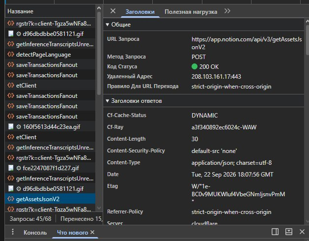

Скриншот 11 — HTTP-заголовок `Server: cloudflare`.

При этом по данным DevTools нельзя определить внутреннюю архитектуру серверов Notion или конкретную систему хранения данных.

**5. Описание пользовательского сценария**

Сценарий: создание страницы и добавление блока.

1. Пользователь открывает сайт Notion.
2. Пользователь создаёт новую страницу.
3. Пользователь вводит название страницы.
4. Пользователь добавляет текстовый или заголовочный блок.
5. Клиентская часть отображает добавленный блок и обрабатывает изменение содержимого.
6. Браузер формирует данные для передачи серверу.
7. Клиентская часть отправляет запрос `POST /api/v3/saveTransactionsFanout`.
8. В запросе передаются `requestId` и массив `transactions`.
9. Сервер обрабатывает полученные данные.
10. Сервер возвращает статус 200 OK и пустой JSON-объект `{}`.
11. Изменения отображаются в интерфейсе страницы.

**Схема взаимодействия**

Пользователь → Интерфейс Notion → Клиентская часть → POST-запрос к API → Серверная часть → 200 OK → Клиентская часть → Отображение изменений.

**6. Построение архитектурной схемы**

Архитектурная схема показывает основные компоненты информационной системы Notion и направление взаимодействия между ними.

Основными компонентами являются пользователь, браузер, интерфейс Notion, клиентская часть, API Notion, сервер приложения, хранилище данных и Cloudflare.

Связи между компонентами:

Пользователь → Браузер — действия пользователя.

Браузер → Интерфейс Notion — отображение страницы.

Интерфейс Notion → Клиентская часть — обработка действий пользователя.

Клиентская часть → API Notion — HTTPS / POST-запрос.

API Notion → Сервер приложения — обработка запроса.

Сервер приложения → Хранилище данных — сохранение данных.

Сервер приложения ↔ Cloudflare — сетевое взаимодействие.

Архитектурная схема была разработана в diagrams.net и сохранена в двух форматах: PNG и исходный редактируемый файл `.drawio`.
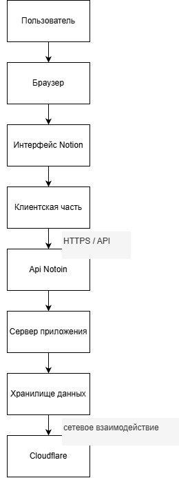

**7. Вывод**

В ходе лабораторной работы была исследована информационная система Notion на примере сценария создания страницы и добавления блока.

Были рассмотрены основные элементы пользовательского интерфейса и HTML-структура элементов страницы.

С помощью DevTools было исследовано сетевое взаимодействие браузера с API сервиса. Был обнаружен POST-запрос `saveTransactionsFanout`, связанный с передачей изменений страницы серверной части. Сервер обработал запрос со статусом 200 OK и вернул пустой JSON-объект.

Также были рассмотрены дополнительные API-запросы, серверные компоненты и предполагаемое хранилище данных. На основе проведённого анализа была сформирована архитектурная модель информационной системы и описана последовательность взаимодействия пользователя, клиентской и серверной частей.
